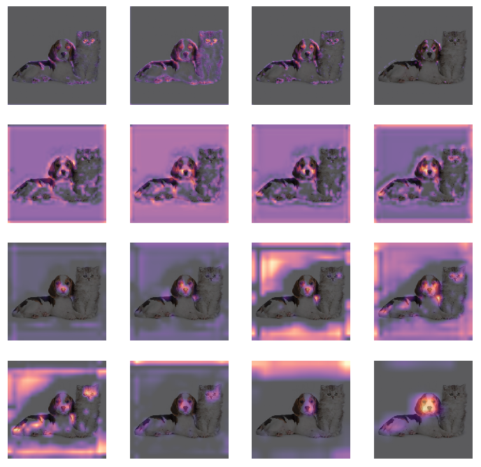

## Experiments in generating localization maps from a convnet.

Inspired by [Grad-CAM: Visual Explanations from Deep Networks via Gradient-based Localization](https://arxiv.org/abs/1610.02391), and [fastai](https://www.fast.ai/) Deep Learning (2018) MOOC (public in early 2019).

